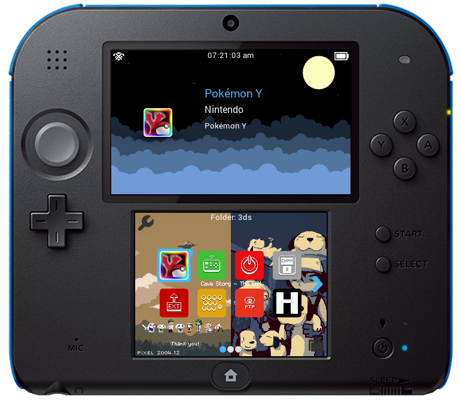

# Red's Screenshot Tool
This screenshot tool takes a batch of exported screenshots and makes them into nice single images. There are some options for exporting your screenshots, too.

### How to use this tool:
1. Launch the program. You need Java installed on your computer.
2. Chose if you want to export the right eye. This option will create 2 files for every screenshot! Use with care!
2. Chose if you want to use template.cfg and template.png images in a template folder.
2. Select the INPUT folder. This is the folder with the broken up images. See below for name format.
2. Select the OUTPUT folder. This is the folder where all of the complete images will be written. 
2. Select the TEMPLATE folder if you chose to use one earlier. 
2. Wait for the images to process
2. Profit!

### How to use template.cfg and template.png:
1. Create template.png. It must be big enough to contain both the top and bottom screenshot. Put it in any empty folder.
2. Create template.cfg. Put it in the template.png folder. It'll look like this:

```text
top:91,50
bottom:131,360
```

- The top: and bottom: denote where the top and bottom screen images should be placed in the template.png The first number is the X location from the top left and the second number is the Y location from the top left (always positive, includes 0).
- Notice how there is no spaces in this document. Do not add spaces. Java will yell at you.

### Name format:

Names:

* "scr\_[num]\_BOTTOM.[ext]" (ninjahax)
* "scr\_[num]\_TOP\_LEFT.[ext]" (ninjahax)
* "scr\_[num]\_TOP\_RIGHT.[ext]" (ninjahax)
* "bot\_[num].[ext]" (NTR)
* "top\_[num].[ext]" (NTR)
* "inf\_[num].[ext]" (NTR)
* "sup\_[num].[ext]" (NTR)
* "[YYYYMMDD]\_[HHMM]\_LO\_[num].[ext]" (TestMenu)
* "[YYYYMMDD]\_[HHMM]\_UR\_[num].[ext]" (TestMenu)
* "[YYYYMMDD]\_[HHMM]\_UL\_[num].[ext]" (TestMenu)
* "[YYYY]-[MM]-[DD]\_[HH]-[MM]-[SS].[num]\_top.bmp" (Luma)
* "[YYYY]-[MM]-[DD]\_[HH]-[MM]-[SS].[num]\_bot.bmp" (Luma)

(If you don't see your format on here, the matching system can be found in [Type.java](./src/red/Type.java). 
Create an issue with the format you would like added or feel free to add it yourself)

Where the values are:

* [num] is a number
* [ext] is a picture format (usually png or bmp)

The numbers for the top screen should match up with the same number for the bottom screen.
This is how the program tells the difference between a top and bottom image pair in order to
merge them together. NTR, ninjahax, and TestMenu images can exist in the same folder and will be merged
independently! 

### Examples output with template





### Examples output without template

