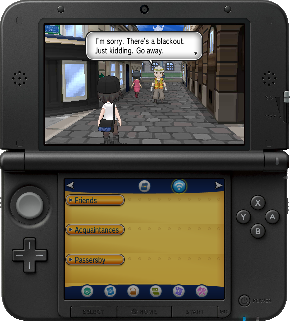
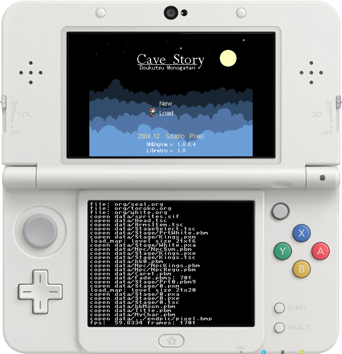
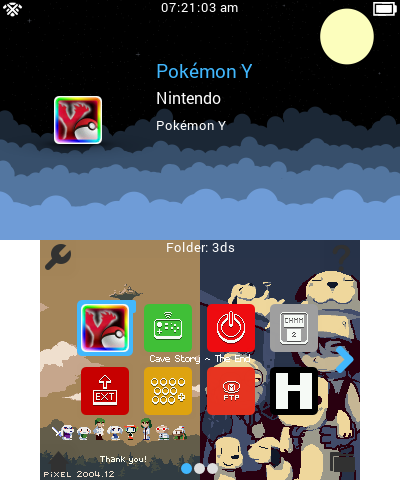
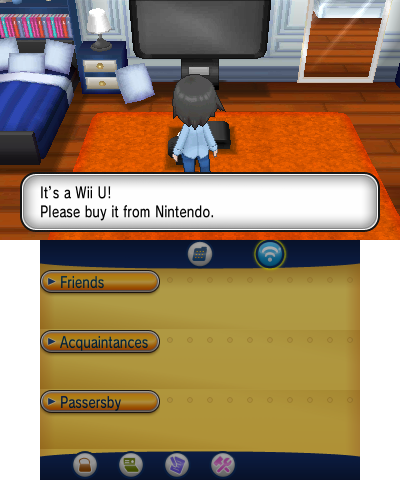

#Red's Screenshot Tool
This screenshot tool takes a batch of exported screenshots and makes them into nice single images. There are some options for exporting your screenshots, too.

###How to use this tool:
1. Launch the program. You need Java installed on your computer.
2. Select the INPUT folder. This is the folder with the broken images.
3. Select the OUTPUT folder. This is the folder where all of the complete images will be written. 
4. Chose if you want to also export the right eye. This option will create 2 files for every screenshot! Use with care!
5. Chose if you want to use the template.cfg and template.png images in the input folder. 
6. Wait for the images to process
7. Profit!

###How to use template.cfg and template.png:
1. Create template.png. It must be big enough to contain both the top and bottom screenshot. Put it in any empty folder.
2. Create template.cfg. Put it in the template.png folder. It'll look like this:
```text
top:91,50
bottom:131,360
```
- The top: and bottom: denote where the top and bottom screen images should be placed in the template.png The first number is the X location from the top left and the second number is the Y location from the top left (always positive, includes 0).
- Notice how there is no spaces in this document. Do not add spaces. Java will yell at you.

###Examples output with template



###Examples output without template


